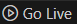

# Trabalho Final de Programação WEB

Integrantes:

- Brenda Breitenbach
- Eduardo Roscioli
- Mauro Fantin

### Para rodar a Aplicação Web

No diretório [API-WEB](./API-WEB/), executar os comandos:

```shell
npm install express dotenv
npm install mysql2
npm install cors
npm start
```

Depois, rodar a tela inicial [Produtos](./Telas/telaProdutos.html):



### Para rodar os testes

No diretório [API-WEB](./API-WEB/), executar os comandos:

```shell
npm install --save-dev jest supertest
npm test
```